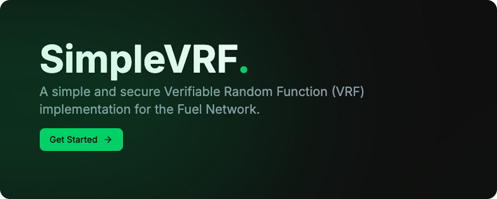

# SimpleVrf


A simple and secure Verifiable Random Function (VRF) implementation for the Fuel Network.

## 🦅 Overview

SimpleVrf is a decentralized random number generation system built on the Fuel Network, utilizing ECVRF (Elliptic Curve Verifiable Random Function) and Byzantine fault-tolerant quorum consensus.

## 🤔 What is SimpleVrf?

SimpleVrf is a decentralized random number generation system that combines ECVRF (Elliptic Curve Verifiable Random Function) with Byzantine fault-tolerant quorum consensus. It provides cryptographically secure, verifiable random numbers that can be used in smart contracts and decentralized applications. The system ensures that random numbers are:

- Unpredictable
- Verifiable
- Decentralized
- Byzantine fault-tolerant

## ⚡️ Quick Start

1. Install dependencies:
```bash
bun install
```

2. Build the project:
```bash
bun build
```

3. Run the worker:
```bash
cd apps/worker
bun dev
```

4. Use the CLI to interact with SimpleVrf:
```bash
cd apps/cli
bun start
```

## 🆔 Contract IDs

| Network | Contract ID |
|---------|-------------|
| Mainnet | 0x62f032d26b18de7f38ec8a159e0b31ac67e600367f53e34fe33701459d9765fb |
| Testnet | 0xf9e5f1f1ca988599e415bcca3b77b582ae48f9e32069cce17fc2d9465fb7c6a1 |

## 👀 Example

Here's a simple example of how to use SimpleVrf in your Fuel contract:

```rust
use simplevrf_fuel_abi::{SimpleVrf, SimpleVrfCallback};

impl SimpleVrfCallback for Contract {
    #[storage(read, write)]
    fn simple_callback(seed: b256, proof: b256) {
        storage.latest_proof.write(proof);
    }
}

// Request a random number
fn request_random_number(seed: b256) -> u64 {
    let simple_vrf = abi(SimpleVrf, vrf_id);
    let fee = simple_vrf.get_fee(AssetId::base());
    let request_id = simple_vrf.request{
        asset_id: AssetId::base().bits(),
        coins: fee, 
    }(seed);
    request_id
}
```

The callback will be triggered when the random number is generated, providing both the seed and the proof.

## 🧱 Components

SimpleVrf consists of several key components:

1. **ECVRF Package**: Core cryptographic implementation of the Elliptic Curve VRF
2. **SimpleVrf Contract**: Main smart contract implementation on Fuel Network
3. **SimpleVrf ABI**: Contract interface definitions
4. **Worker**: Service that processes VRF requests and generates random numbers
5. **CLI**: Command-line interface for interacting with SimpleVrf
6. **SimpleVrf Example**: Example implementation showing how to use SimpleVrf

## 🤝 Contribution Guidelines

- Feel Free to Open a PR/Issue for any feature or bug(s).
- Make sure you follow the [community guidelines](https://docs.github.com/en/github/site-policy/github-community-guidelines).
- Feel free to open an issue to ask a question/discuss anything about simplevrf.
- Have a feature request? Open an Issue!
- Please ensure to run `bun test` before submitting your PRs!

## 𐄷 License

Copyright 2025 Hemanth Krishna

Licensed under MIT License : https://opensource.org/licenses/MIT


<p align="center">Made with ❤ , and some cans of Diet Coke 🧃</p>